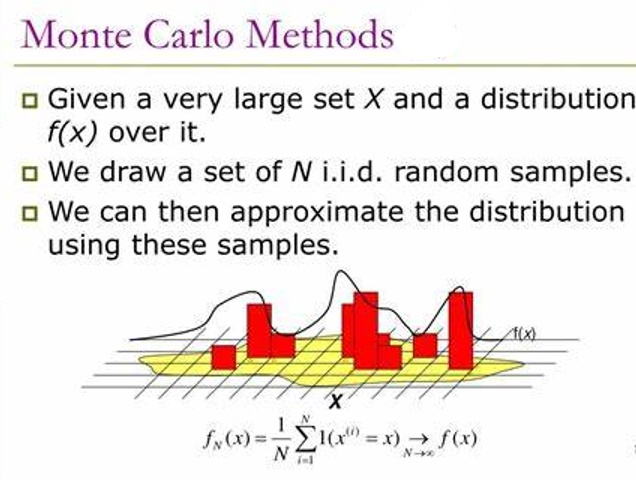

# 🔥 Monte Carlo methods and their applications
Data scientist | [Anass MAJJI](https://www.linkedin.com/in/anass-majji-729773157/)
***

In this project, we highlight the main theorems of Monte Carlo methods and their applications. 

 

# 🚀 Repository Structure

- **README.md :** The top level README for reviewers of this project.
- **Images :**  The folder contains images used on the notebook. 
- **Monte Carlo.ipynb :** a notebook that details the Monte Carlo theorems with their demonstrations.

# :mailbox_closed: Contact
For any information, feedback or questions, please [contact me][anass-email]

[anass-email]: mailto:anassmajji34@gmail.com

